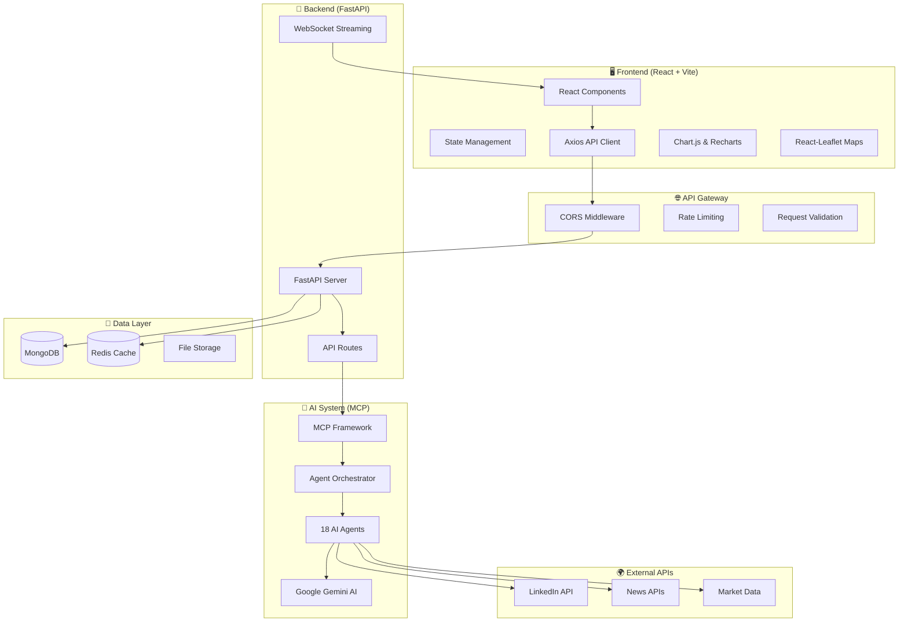
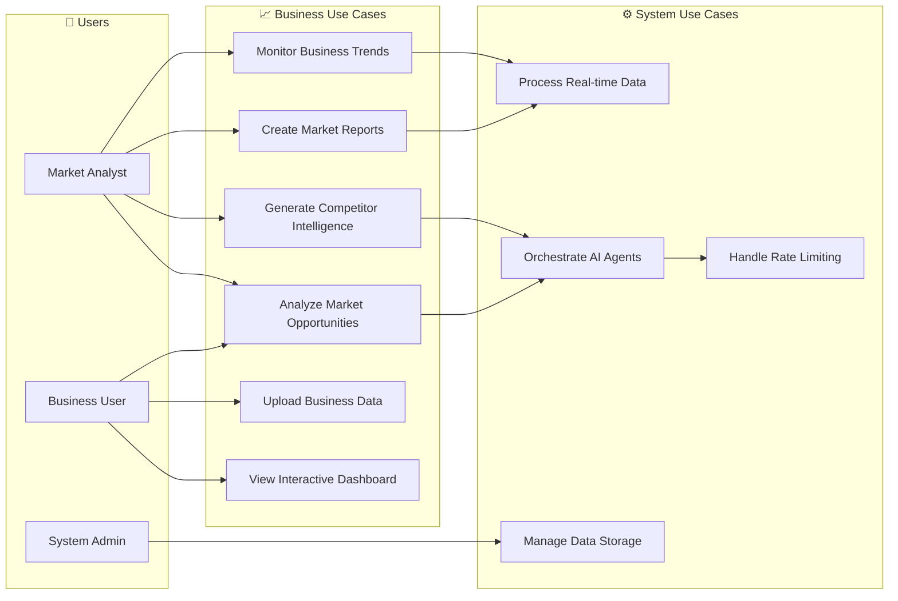
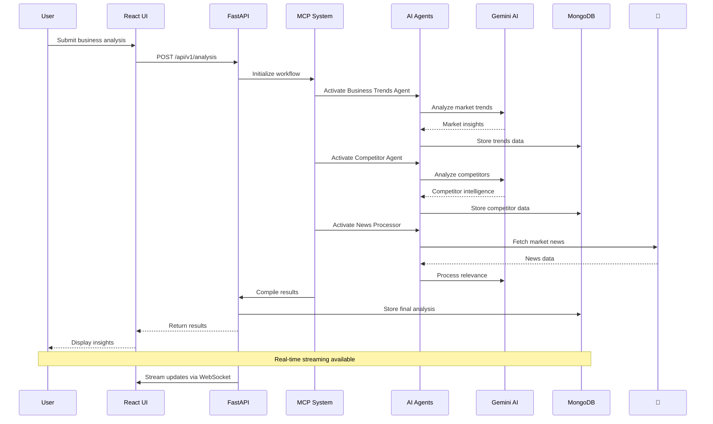
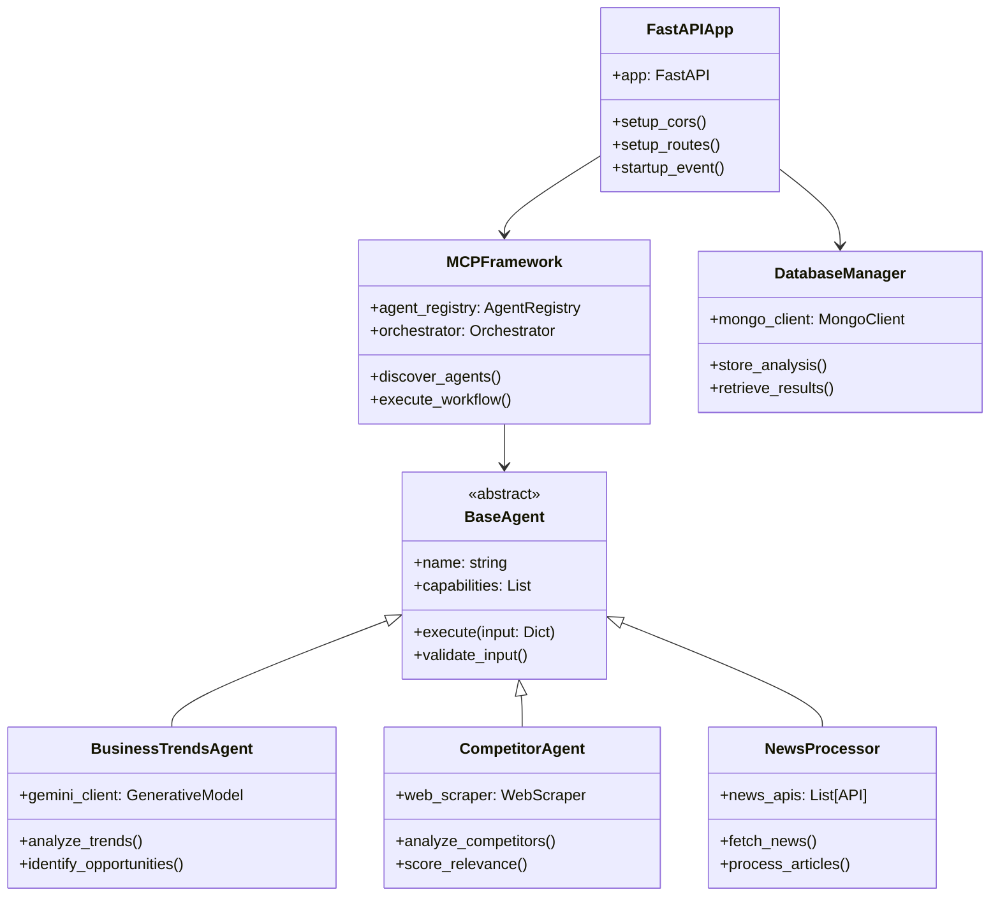
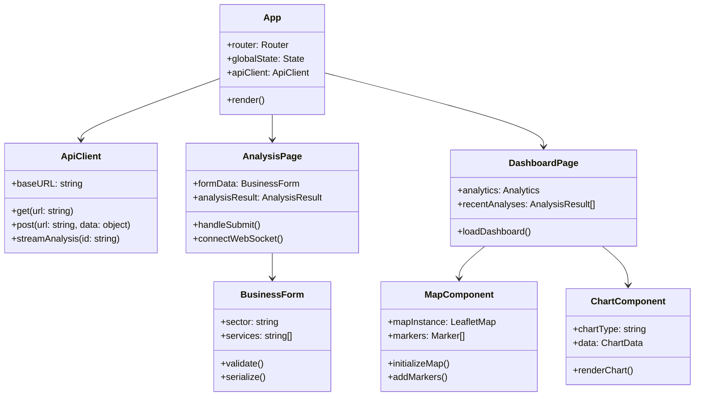
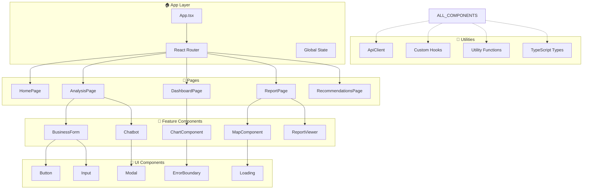
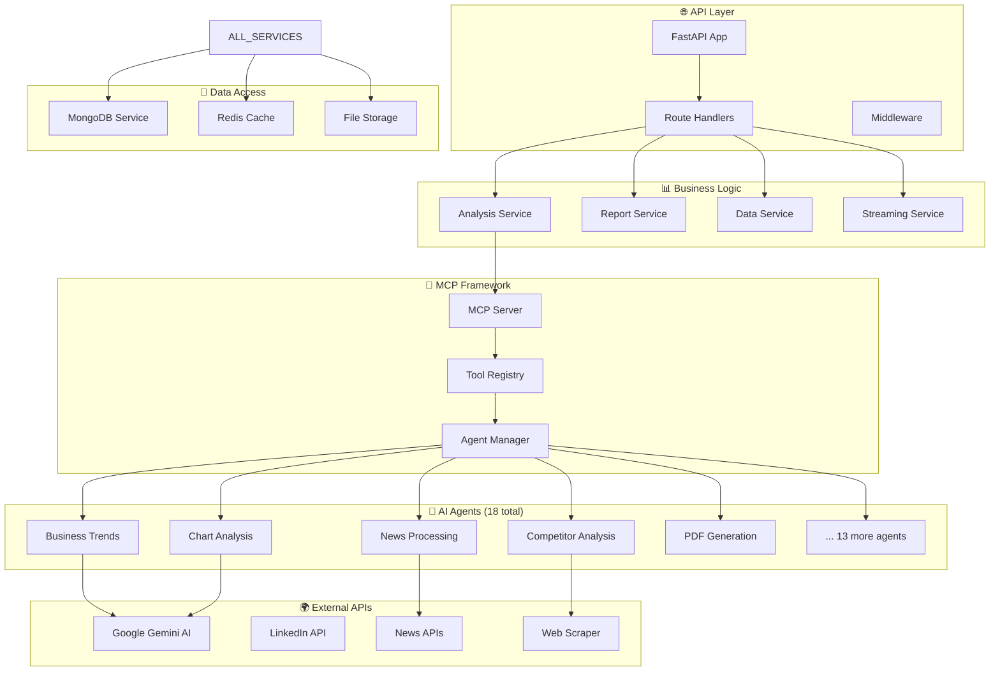
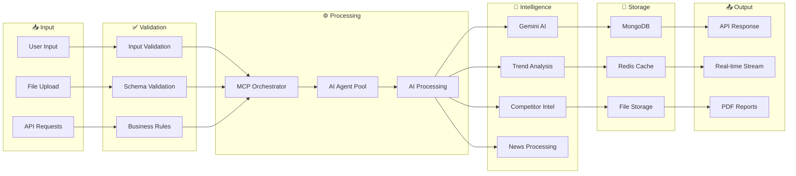
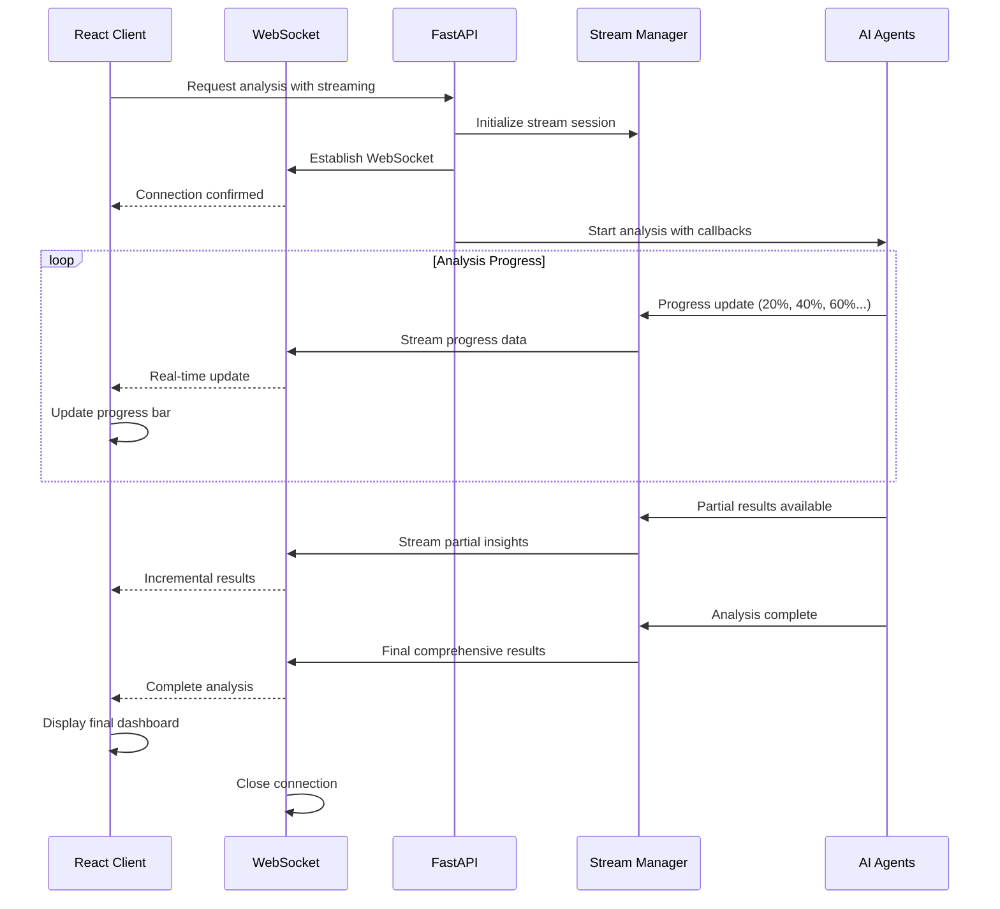

# 🏗️ OpportunityDetection - Architecture Overview

## 🎯 System Architecture Summary

The OpportunityDetection platform is built with a **React frontend** and **FastAPI backend** using **MCP (Model Context Protocol)** for AI agent orchestration.

### **Technology Stack Overview**

#### **Frontend (React 18 + Vite)**
- **Framework**: React 18.3.1 with functional components and hooks
- **Build Tool**: Vite 5.4.2 for fast development and building
- **Styling**: Tailwind CSS 3.4.1 for responsive design
- **Visualization**: Chart.js 4.5.0 & Recharts 3.1.2 for data charts
- **Maps**: React-Leaflet 5.0.0 for interactive geographic analysis
- **Animation**: Framer Motion 12.23.12 for smooth interactions
- **HTTP Client**: Axios 1.11.0 for API communication

#### **Backend (FastAPI + MCP)**
- **Framework**: FastAPI with Python 3.13.2
- **AI Orchestration**: MCP (Model Context Protocol) with 18 AI agents
- **AI Provider**: Google Generative AI (Gemini 1.5 Pro)
- **Database**: MongoDB for flexible data storage
- **Caching**: Redis for performance optimization
- **Server**: Uvicorn ASGI server

---

## 📊 High-Level System Architecture



---

## 🎭 Core Use Cases



---

## 🔄 Market Analysis Workflow



---

## 🏛️ Core System Classes

### **Backend Architecture**



### **Frontend Architecture**



---

## 🔧 Component Architecture

### **React Component Hierarchy**



### **Backend Service Structure**



---

## 📈 Data Flow Architecture



---

## 🔄 Real-time Streaming Architecture



---

## 🚀 Deployment Architecture

```mermaid
graph TD
    subgraph "👥 Users"
        BROWSER[Web Browsers]
        MOBILE[Mobile Devices]
    end
    
    subgraph "🌐 Edge & CDN"
        CDN[Content Delivery Network]
        LOAD_BALANCER[Load Balancer]
    end
    
    subgraph "🏗️ Application Layer"
        REACT[React App (Vite)]
        NGINX[Nginx Reverse Proxy]
        FASTAPI_CLUSTER[FastAPI Cluster]
    end
    
    subgraph "🤖 AI Services"
        MCP_SERVICES[MCP Services]
        AGENT_POOL[AI Agent Pool]
        GEMINI_API[Google Gemini API]
    end
    
    subgraph "💾 Data Layer"
        MONGODB_CLUSTER[MongoDB Cluster]
        REDIS_CLUSTER[Redis Cluster]
        OBJECT_STORAGE[Object Storage]
    end
    
    subgraph "📊 Monitoring"
        LOGS[Centralized Logging]
        METRICS[Performance Metrics]
        ALERTS[Alert System]
    end
    
    BROWSER --> CDN
    MOBILE --> CDN
    CDN --> LOAD_BALANCER
    LOAD_BALANCER --> NGINX
    NGINX --> REACT
    NGINX --> FASTAPI_CLUSTER
    
    FASTAPI_CLUSTER --> MCP_SERVICES
    MCP_SERVICES --> AGENT_POOL
    AGENT_POOL --> GEMINI_API
    
    FASTAPI_CLUSTER --> MONGODB_CLUSTER
    FASTAPI_CLUSTER --> REDIS_CLUSTER
    FASTAPI_CLUSTER --> OBJECT_STORAGE
    
    ALL_SERVICES --> LOGS
    ALL_SERVICES --> METRICS
    METRICS --> ALERTS
```

---

## 🔧 Key Technical Features

### **Frontend Capabilities**
- ⚡ **Fast Development**: Vite for instant hot reload and fast builds
- 🎨 **Modern UI**: Tailwind CSS with responsive design principles
- 📊 **Rich Visualizations**: Interactive charts with Chart.js and Recharts
- 🗺️ **Geographic Analysis**: Leaflet maps with custom markers and clusters
- 🌊 **Smooth Animations**: Framer Motion for engaging user interactions
- 📱 **Mobile Responsive**: Works seamlessly across all device sizes

### **Backend Capabilities**
- 🚀 **High Performance**: FastAPI with async/await for concurrent processing
- 🤖 **AI Orchestration**: MCP framework managing 18 specialized AI agents
- 🧠 **Advanced AI**: Google Gemini 1.5 Pro for sophisticated analysis
- 💾 **Flexible Storage**: MongoDB for complex data structures
- ⚡ **Fast Caching**: Redis for sub-millisecond data access
- 📡 **Real-time Streaming**: WebSocket support for live updates

### **AI Agent Capabilities**
1. **Business Trends Agent** - Market trend identification and analysis
2. **Competitor Agent** - Comprehensive competitor intelligence
3. **News Processor** - Real-time news analysis and sentiment
4. **Chart Analysis Agent** - Automated chart generation and insights
5. **LinkedIn Scraper** - Professional network data extraction
6. **Market Analyzer** - Comprehensive market assessment
7. **PDF Generator** - Professional report creation
8. **Summarization Agent** - Content summarization and key insights
9. **Trend Identification** - Pattern recognition in market data
10. **Working Space Manager** - Workflow and task coordination
11. **Info Extractor** - Data extraction from various sources
12. **Keywording Agent** - SEO and keyword analysis
13. **Top Competitors** - Competitive landscape mapping
14. **Dynamic Chart Generator** - Interactive visualization creation
15. **CSV Reader** - Data processing and analysis
16. **Gemini API Manager** - AI model interaction optimization
17. **Analyze Data Agent** - Statistical analysis and insights
18. **Multi-Agent Coordinator** - Agent workflow orchestration

---

## 📊 Performance Metrics

### **Response Time Targets**
- **API Endpoints**: < 200ms average response time
- **Analysis Processing**: 30-120 seconds for complete market analysis
- **Real-time Updates**: < 100ms WebSocket latency
- **Database Queries**: < 50ms average query execution
- **File Uploads**: Support up to 100MB with progress tracking

### **Scalability Targets**
- **Concurrent Users**: 1,000+ simultaneous active users
- **Daily Analyses**: 10,000+ market analyses per day
- **Data Processing**: 1TB+ of market data processed monthly
- **API Requests**: 1M+ API requests per day
- **Storage Growth**: Scalable to petabytes of historical data

### **Availability Targets**
- **Uptime**: 99.9% availability (8.77 hours downtime/year)
- **Error Rate**: < 0.1% error rate for API requests
- **Recovery Time**: < 5 minutes for service restoration
- **Backup Recovery**: < 1 hour for complete data restoration

---

This architecture overview provides a comprehensive yet accessible view of the OpportunityDetection platform's technical foundation, emphasizing the React frontend and FastAPI backend with MCP-based AI agent orchestration.
