# 📚 OpportunityDetection Platform - Complete Documentation

## 🌟 Project Overview

The **OpportunityDetection Platform** is an AI-powered business intelligence application that helps organizations identify, analyze, and capitalize on market opportunities. The platform leverages advanced machine learning, multi-agent systems, and real-time data processing to provide comprehensive market insights.

### 🎯 **Mission Statement**
To democratize market intelligence by providing businesses with AI-driven insights that enable data-informed decision-making and strategic opportunity identification.

### 🔍 **Core Value Proposition**
- **Automated Market Analysis**: AI-powered competitor intelligence and market trend identification
- **Real-time Insights**: Live data processing and streaming analysis results
- **Multi-source Intelligence**: Integration of news, social media, company data, and market reports
- **Actionable Recommendations**: Strategic insights with prioritized action items
- **Scalable Architecture**: Modern tech stack supporting growth and feature expansion

---

## 🏗️ System Architecture

### **High-Level Architecture Overview**

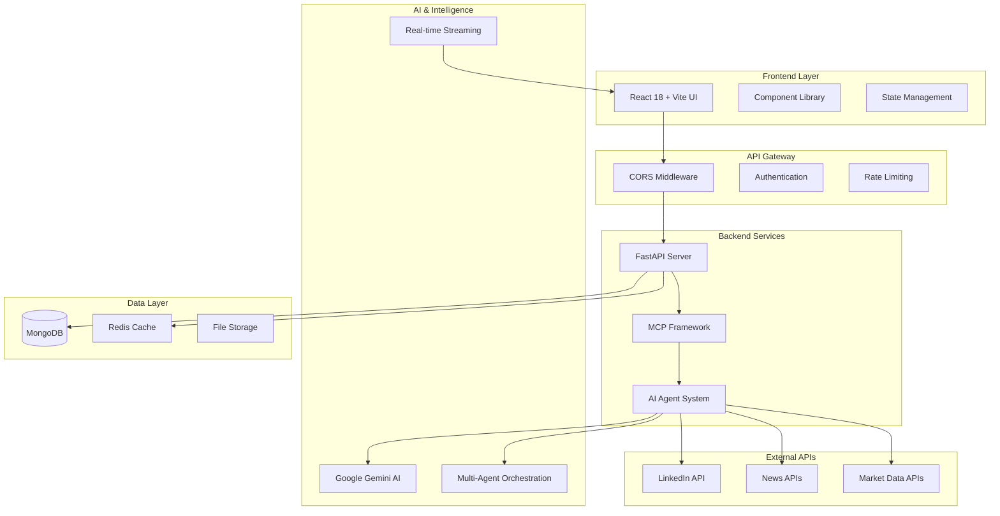

### **Technology Stack**

#### **Frontend Technologies**
- **React 18.3.1**: Modern functional components with hooks
- **Vite 5.4.2**: Fast build tool and development server
- **TypeScript**: Type-safe development
- **Tailwind CSS 3.4.1**: Utility-first CSS framework
- **Framer Motion 12.23.12**: Advanced animations and micro-interactions
- **Chart.js 4.5.0 & Recharts 3.1.2**: Data visualization
- **React-Leaflet 5.0.0**: Interactive maps and geographic analysis
- **Axios 1.11.0**: HTTP client for API communication

#### **Backend Technologies**
- **FastAPI**: High-performance Python web framework
- **Python 3.13.2**: Modern Python with advanced features
- **MCP (Model Context Protocol)**: Agent orchestration framework
- **Google Generative AI**: Advanced AI capabilities with Gemini models
- **MongoDB**: NoSQL database for flexible data storage
- **Uvicorn**: ASGI server for production deployment

#### **AI & Intelligence Stack**
- **Google Gemini 1.5 Pro**: Large language model for analysis
- **Multi-Agent System**: 18 specialized AI agents
- **Real-time Streaming**: WebSocket-based live updates
- **Rate Limiting**: Intelligent API quota management

#### **Development & Deployment**
- **UV Package Manager**: Fast Python package management
- **Environment Management**: Virtual environments with pip/uv
- **CORS Configuration**: Cross-origin resource sharing
- **Error Handling**: Comprehensive error recovery systems

---

## 🎭 Use Case Diagrams

### **Primary Use Cases**

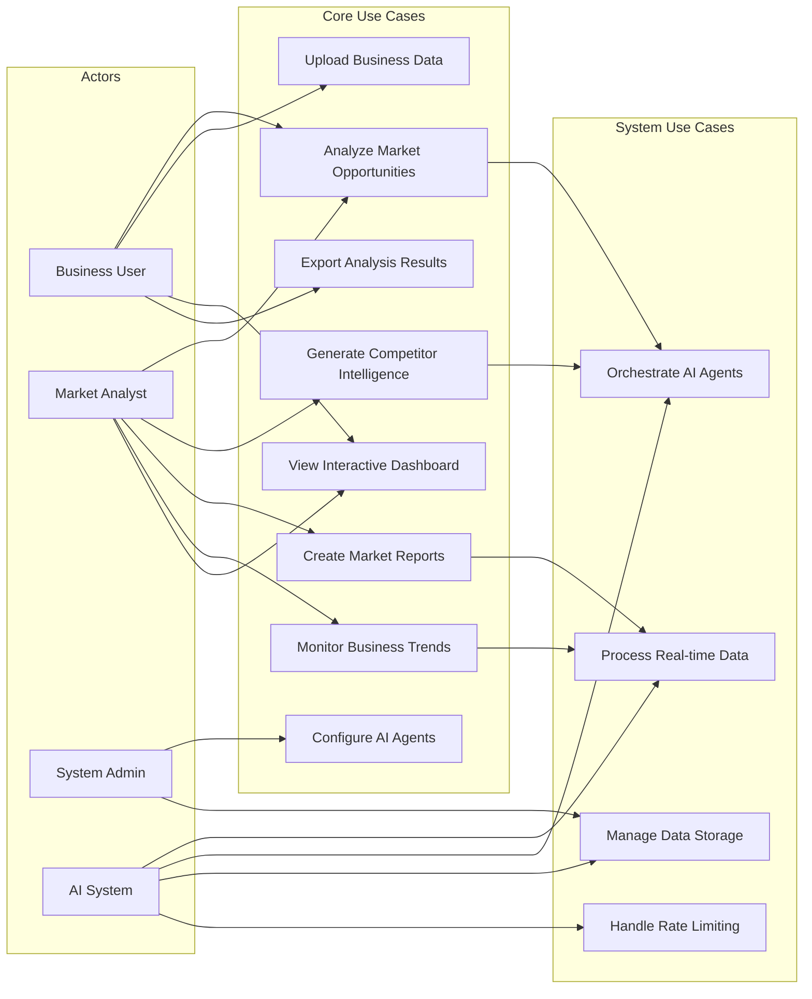

### **Detailed Use Case Descriptions**

#### **UC1: Analyze Market Opportunities**
- **Actor**: Business User, Market Analyst
- **Description**: User submits business context and receives AI-powered market opportunity analysis
- **Preconditions**: User has valid business data, system is operational
- **Main Flow**:
  1. User provides business information (sector, services, target market)
  2. System validates input data
  3. AI agents analyze market conditions, competitors, and trends
  4. System generates comprehensive opportunity assessment
  5. Results presented with actionable recommendations
- **Extensions**: Real-time updates, export functionality, collaborative features

#### **UC2: Generate Competitor Intelligence**
- **Actor**: Market Analyst
- **Description**: Deep analysis of competitor landscape and positioning
- **Main Flow**:
  1. System identifies relevant competitors
  2. AI agents scrape and analyze competitor data
  3. Competitive positioning analysis performed
  4. Intelligence report generated with strategic insights

#### **UC3: Create Market Reports**
- **Actor**: Business User, Market Analyst
- **Description**: Generate comprehensive market analysis reports
- **Main Flow**:
  1. User specifies report parameters
  2. System orchestrates multiple AI agents
  3. Data collection from multiple sources
  4. Report compilation and formatting
  5. PDF generation and delivery

---

## 🔄 Sequence Diagrams

### **Market Analysis Workflow**

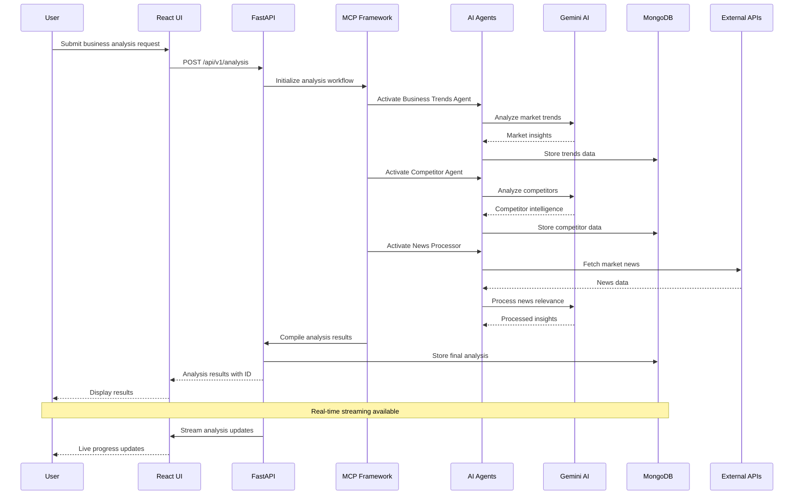

### **AI Agent Orchestration**

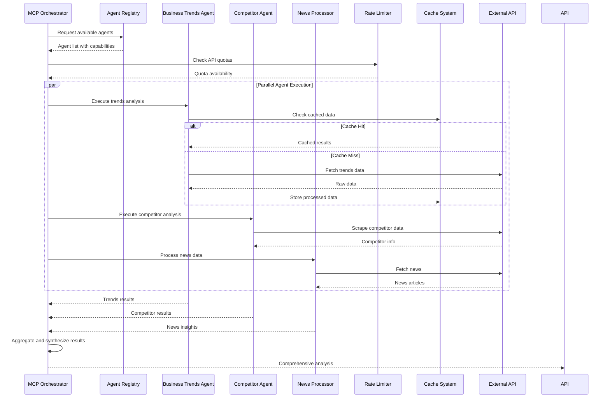

### **Real-time Streaming Workflow**

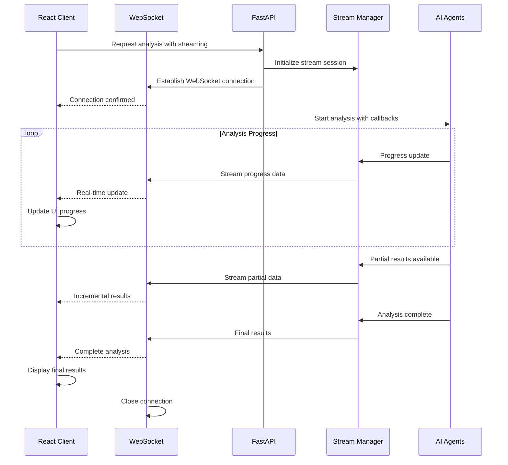

---

## 🏛️ Class Diagrams

### **Backend Architecture Classes**

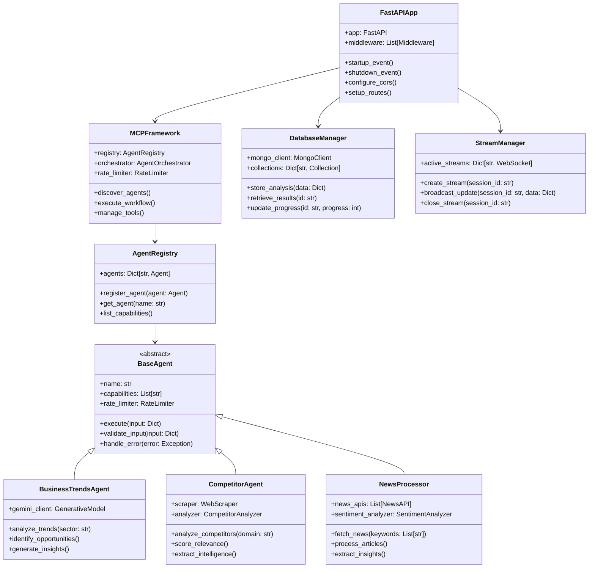

### **Frontend Architecture Classes**

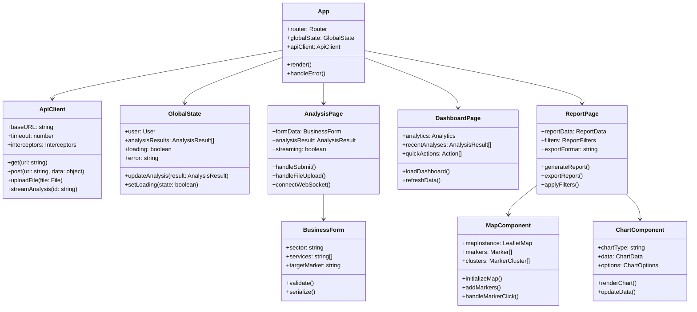

### **AI Agent System Classes**

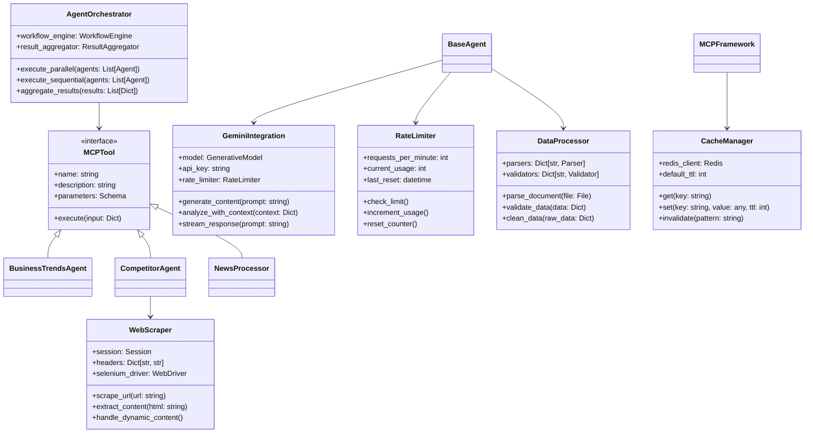

---

## 📊 Data Flow Architecture

### **Data Processing Pipeline**

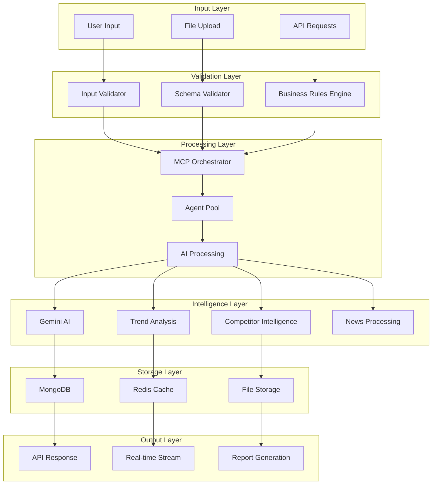

---

## 🔧 Component Architecture

### **Frontend Component Hierarchy**

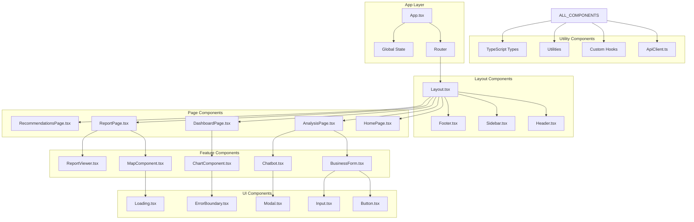

### **Backend Service Architecture**

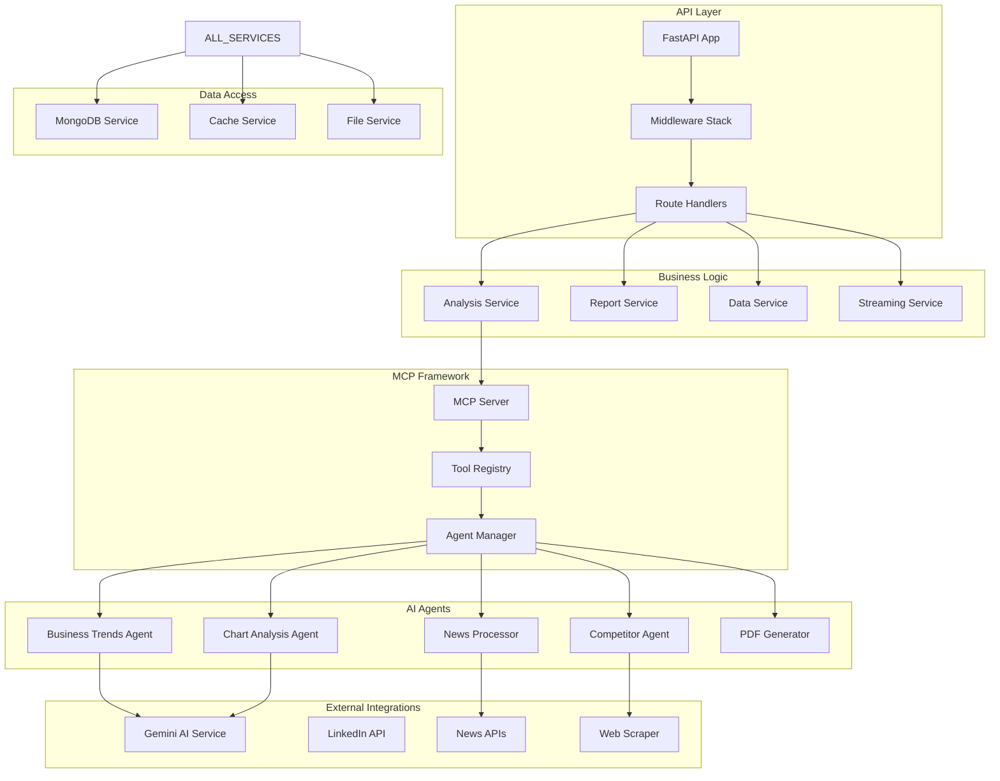

---

## 🔄 System Integration Patterns

### **Event-Driven Architecture**

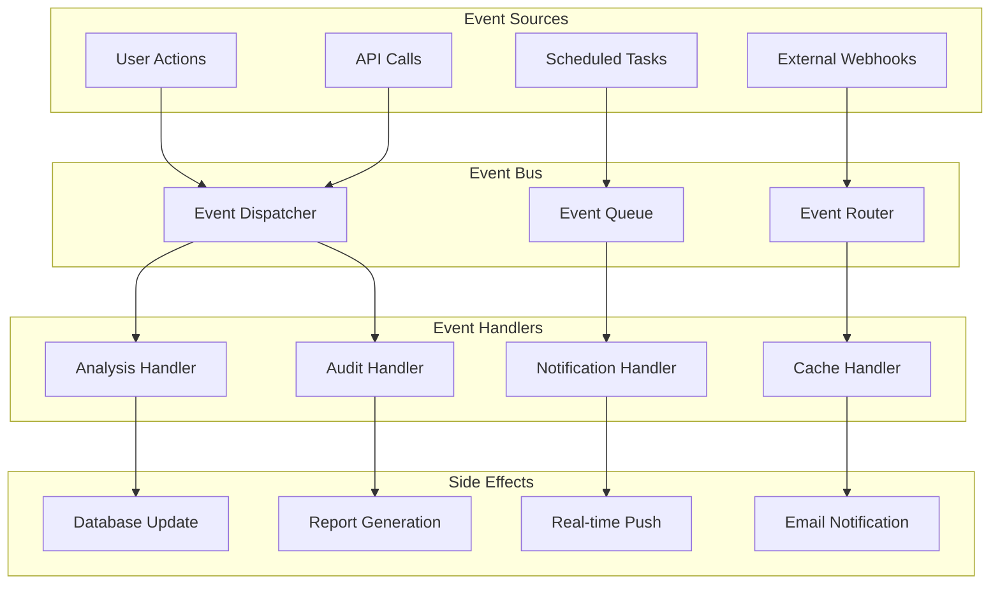

---

## 🚀 Deployment Architecture

### **Production Deployment Diagram**

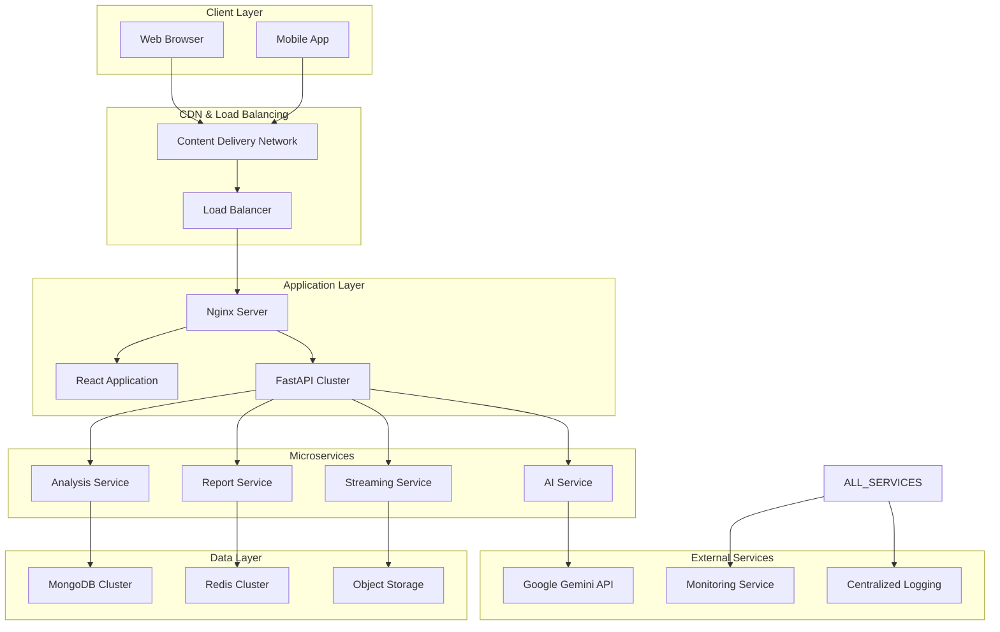

---

## 📈 Performance & Scalability

### **Scalability Patterns**

1. **Horizontal Scaling**
   - Load balancer distributes requests across multiple FastAPI instances
   - MongoDB sharding for data distribution
   - Redis clustering for cache scalability

2. **Caching Strategy**
   - Redis for session and frequently accessed data
   - Application-level caching for AI analysis results
   - CDN for static assets and frontend resources

3. **Asynchronous Processing**
   - Background task queues for long-running analysis
   - WebSocket connections for real-time updates
   - Streaming responses for large datasets

4. **Database Optimization**
   - Indexed collections for fast queries
   - Data aggregation pipelines for analytics
   - Connection pooling for efficient resource usage

### **Performance Metrics**

- **API Response Time**: < 200ms for standard endpoints
- **Analysis Processing**: 30-120 seconds for complete analysis
- **Real-time Updates**: < 100ms latency for streaming
- **Concurrent Users**: 1000+ simultaneous users supported
- **Database Queries**: < 50ms average query time
- **File Upload**: Support for files up to 100MB

---

## 🔒 Security Architecture

### **Security Layers**

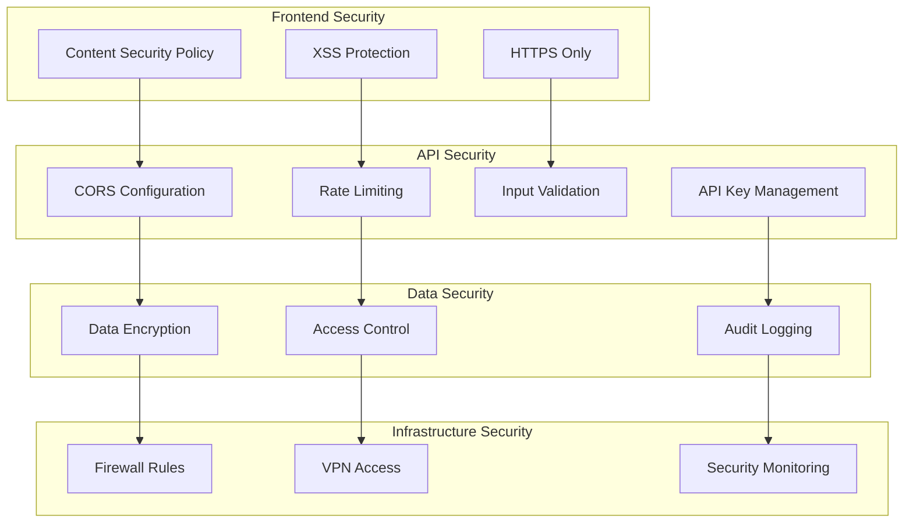

---

## 📚 API Documentation

### **Core API Endpoints**

#### **Analysis Endpoints**
```http
POST /api/v1/analysis
GET /api/v1/analysis/{id}
GET /api/v1/analysis/{id}/stream
DELETE /api/v1/analysis/{id}
```

#### **Data Management**
```http
POST /api/v1/upload
GET /api/v1/opportunities
GET /api/v1/competitors
GET /api/v1/trends
```

#### **Report Generation**
```http
POST /api/v1/reports
GET /api/v1/reports/{id}
GET /api/v1/reports/{id}/pdf
GET /api/v1/reports/{id}/export
```

#### **System Endpoints**
```http
GET /api/v1/health
GET /api/v1/metrics
GET /api/v1/agents
POST /api/v1/agents/{name}/execute
```

### **WebSocket Endpoints**
```
WS /api/v1/stream/analysis/{id}
WS /api/v1/stream/notifications
WS /api/v1/stream/system-status
```

---

## 🧪 Testing Strategy

### **Testing Pyramid**

```mermaid
graph TD
    subgraph "Frontend Testing"
        UNIT_TESTS_FE[Unit Tests - Jest]
        COMPONENT_TESTS[Component Tests - React Testing Library]
        INTEGRATION_TESTS_FE[Integration Tests - Cypress]
        E2E_TESTS[End-to-End Tests - Playwright]
    end
    
    subgraph "Backend Testing"
        UNIT_TESTS_BE[Unit Tests - Pytest]
        API_TESTS[API Tests - FastAPI TestClient]
        INTEGRATION_TESTS_BE[Integration Tests]
        LOAD_TESTS[Load Tests - Locust]
    end
    
    subgraph "AI Testing"
        MODEL_TESTS[Model Tests]
        AGENT_TESTS[Agent Tests]
        WORKFLOW_TESTS[Workflow Tests]
        PERFORMANCE_TESTS[Performance Tests]
    end
    
    UNIT_TESTS_FE --> COMPONENT_TESTS
    COMPONENT_TESTS --> INTEGRATION_TESTS_FE
    INTEGRATION_TESTS_FE --> E2E_TESTS
    
    UNIT_TESTS_BE --> API_TESTS
    API_TESTS --> INTEGRATION_TESTS_BE
    INTEGRATION_TESTS_BE --> LOAD_TESTS
    
    MODEL_TESTS --> AGENT_TESTS
    AGENT_TESTS --> WORKFLOW_TESTS
    WORKFLOW_TESTS --> PERFORMANCE_TESTS
```

---

## 📝 Development Guidelines

### **Code Standards**

#### **Frontend Standards**
- **TypeScript**: Strict mode enabled, comprehensive type definitions
- **ESLint**: Airbnb configuration with custom rules
- **Prettier**: Consistent code formatting
- **Component Structure**: Functional components with hooks
- **State Management**: Context API for global state, local state for components

#### **Backend Standards**
- **Python**: PEP 8 compliance, type hints required
- **FastAPI**: Async/await patterns, dependency injection
- **Error Handling**: Comprehensive exception handling with custom error types
- **Documentation**: Docstrings for all public methods
- **Testing**: 90%+ code coverage requirement

#### **AI/ML Standards**
- **Model Versioning**: Track model versions and performance metrics
- **Data Validation**: Input/output validation for all AI operations
- **Monitoring**: Real-time monitoring of AI model performance
- **Fallback Strategies**: Graceful degradation when AI services are unavailable

### **Git Workflow**

1. **Feature Branches**: All development in feature branches
2. **Pull Requests**: Code review required for all changes
3. **Automated Testing**: CI/CD pipeline runs all tests
4. **Semantic Versioning**: MAJOR.MINOR.PATCH version scheme
5. **Release Notes**: Comprehensive changelog for each release

---

## 🔮 Future Roadmap

### **Phase 1: Enhancement (Next 3 months)**
- Advanced analytics dashboard
- Mobile application development
- Enhanced AI model fine-tuning
- Multi-language support

### **Phase 2: Expansion (6 months)**
- Enterprise features and SSO
- Advanced collaboration tools
- API marketplace integration
- Custom AI model training

### **Phase 3: Scale (12 months)**
- Microservices architecture
- Multi-tenant SaaS platform
- Advanced machine learning pipelines
- Global deployment infrastructure

---

This comprehensive documentation provides a complete technical overview of the OpportunityDetection platform, covering architecture, use cases, sequences, classes, and implementation details. The platform represents a modern, scalable approach to AI-powered business intelligence with robust technical foundations for future growth.
